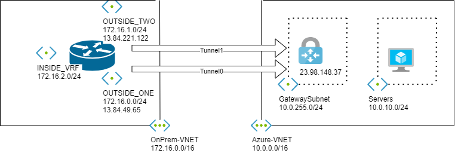

# Configuring Multiple IPSec VPN Tunnels with BGP Between Cisco CSR 1000v and Azure VPN Gateway

## Introduction


[Azure VPN Gateways](https://docs.microsoft.com/en-us/azure/vpn-gateway/) support up to 10Gbps of aggregated throughput across a maximum of 30 IPSec tunnels while [Azure Virtual WAN](https://docs.microsoft.com/en-us/azure/virtual-wan/virtual-wan-about) offers up to 20Gbps of aggregated throughput across 2000 IPSec tunnels per virtual hub; however in both cases a single IPSec tunnel cannot exceed 1.25Gbps of throughput.

>[!NOTE]
Azure documentation mentions 1Gbps throughput per tunnel (see [here](https://docs.microsoft.com/azure/virtual-wan/virtual-wan-about#what-is-the-total-vpn-throughput-of-a-vpn-tunnel-and-a-connection) and [here](https://docs.microsoft.com/azure/vpn-gateway/vpn-gateway-about-vpn-gateway-settings#benchmark)); however in practice it is possible to achieve up to 1.25Gbps

This is not a limitation in Azure but rather a limitation in all software based IPSec VPN solutions, which means that even if you use your favorite NVA in Azure - or any other Cloud provider by that matter - you will face the same per-tunnel performance cap. This is because of the nature of tunneling; the Virtual Machine's Ethernet interface can only direct incoming packets within a tunnel to a single CPU core, thus the performance is limited to one CPU core regardless of the number of CPU cores and memory available. Additionally, a VPN Gateway can have up to 4 BGP speakers - two BGP speakers per Gateway instance - if it is configured in [active-active mode](https://docs.microsoft.com/en-us/azure/vpn-gateway/vpn-gateway-activeactive-rm-powershell) and **"Custom Azure APIPA BGP IP address"** is configured. These limitations mean that up to 5Gbps of throughput can be achieved between an IPSec VPN appliance on-premises and Azure native IPSec VPN solutions if BGP is used to exchange routing information, which is recommended in most cases.

The above presents a challenge for example when there is a requirement to encrypt traffic over ExpressRoute circuits of 5Gpbs and 10Gbps using BGP over IPSec because in order to realize the full available bandwidth of the ExpressRoute circuit over the encrypted channel multiple IPSec VPN appliances are required on-premises.

This article explores the use of [VRF Aware IPSec and Front Door VRF](https://www.cisco.com/c/en/us/td/docs/ios-xml/ios/sec_conn_ikevpn/configuration/xe-3s/VRF-Aware_IPsec.html) - a feature introduced by Cisco in IOS release 12.2(15)T to allow for an IPSec tunnel to belong to a different VRF from the endpoints it is encrypting traffic for - to create multiple IPSec tunnels running BGP between a single Cisco CSR 1000v and Azure VPN Gateway, allowing users to achieve up to 10Gbps between on-premises and Azure VPN Gateway.

>[!NOTE]
Azure SDN only allows up to eight equal cost routes to be programmed into a NIC, thus it is not possible to achieve more than 10Gbps of throughput between on-premises network and Azure using native IPSEC VPN solutions

## Setup

A possibility would be having multiple devices on-premises, each of them with a tunnel to the Azure VPN Gateways. The network would load balance traffic between them with ECMP, and that would increase the total available bandwidth. However, this solution would increase costs: instead, we will virtualize the onprem device with VRF technology so that it pretends to be different devices (two in this example). For simplicity reasons we will configure the Azure VPN Gateway in active-standby mode, APIPA won't be configured and only two tunnels will be established; each tunnel on the CSR will have a BGP session to the same BGP speaker on the Azure VPN Gateway.

The following diagram depicts the reference architecture used in this example:



In order to keep this article concise I won't go over the steps for creating the different resources in Azure, but rather will focus on the configuration of the Cisco CSR 1000v.

## Cisco CSR 1000v Configuration

First we need to create the VRFs. The number of VRFs needed depends on the number of BGP speakers configured on the Azure VPN Gateway and the number of tunnels needed to achieve the desired throughput; for instance if all four BGP speakers are configured and the desired throughput is the maximum of 10Gbps then we need to create 2 VRFs because each VRF will allow us to achieve 5Gbps through 4 tunnels running BGP; we also need to create an additional VRF for the interface(s) facing the internal network(s), thus a total of 3 VRFs are needed. In this example we will only establish two tunnels, each in its own VRF, so we will be creating 3 VRFs. The key here is that VRFs `OUTSIDE_ONE` and `OUTSIDE_TWO` will be importing the BGP learned routes from VRF `INSIDE_VRF` into their routing tables, while `INSIDE_VRF` will be importing the BGP learned routes from both `OUTSIDE_ONE` and `OUTSIDE_TWO` VRFs:

```Bash
ip vrf OUTSIDE_ONE
  rd 64900:1
  route-target export 64900:1
  route-target import 64900:3
  exit
!
ip vrf OUTSIDE_TWO
  rd 64900:2
  route-target export 64900:2
  route-target import 64900:3
  exit
!
ip vrf INSIDE_VRF
  rd 64900:3
  route-target export 64900:3
  route-target import 64900:2
  route-target import 64900:1
  exit
!
```

The virtualization of the CSR 1000v in different devices happens only on the Azure-facing side (the `OUTSIDE_ONE` and `OUTSIDE_TWO` "virtual routers" or VRFs), but in the onprem-facing side (`INSIDE`) a single IP is presented. It is like actually having 3 different routers inside of the CSR 1000v, where the `INSIDE` router communicates with `OUTSIDE_ONE` and `OUTSIDE_TWO`.

With the VRFs created we now need to assign the interfaces to their respective VRF. Note that in this particular example we are simulating an onprem device with a Cisco CSR 1000v running in Azure. Hence, the interface `GigabitEthernet 1` must remain in the `Global VRF` because there is a default route configured in the `Global Routing Table` pointing to this interface to allow connectivity from the Internet. However if you are configuring your devices on premises you want to assign each (sub)interface connecting to the Azure VPN Gateway to a VRF for consistency:

```Bash
interface GigabitEthernet2
  ip vrf forwarding OUTSIDE_TWO
  ip address 172.16.1.4 255.255.255.0
  no shutdown
  exit
!
interface GigabitEthernet3
  ip vrf forwarding INSIDE_VRF
  ip address 172.16.2.4 255.255.255.0
  no shutdown
  exit
!
```

We now need to define the IKEv2 and IPSec configuration that we will use to encrypt the traffic over the tunnels. Note that a separate IKEv2 policy, IKEv2 profile and IPSec profile needs to be defined per each VRF excluding the VRF associated with the interface connected to the internal network. Also note how IKEv2 profile `VRF_OUTSIDE_ONE_PROFILE` is missing configuration parameter `match fvrf`; this is because for this example it will use interface `GigabitEthernet 1` for IKEv2 negotiation, which belongs to the `Global VRF`:

```Bash
crypto ikev2 proposal AZURE_PROPOSAL
  encryption aes-cbc-256 aes-cbc-128 3des
  integrity sha1
  group 2
  exit
!
crypto ikev2 policy VRF_OUTSIDE_ONE_POLICY
  match address local 172.16.0.5
  proposal AZURE_PROPOSAL
  exit
!
crypto ikev2 policy VRF_OUTSIDE_TWO_POLICY
  match fvrf OUTSIDE_TWO
  match address local 172.16.1.4
  proposal AZURE_PROPOSAL
  exit
!  
crypto ikev2 keyring AZURE_KEYRING
  peer AZURE_VNG
    address 23.98.148.37
    pre-shared-key azure123
    exit
  exit
!
crypto ikev2 profile VRF_OUTSIDE_ONE_PROFILE
  match address local interface GigabitEthernet1
  match identity remote address 23.98.148.37  255.255.255.255
  authentication remote pre-share
  authentication local pre-share
  keyring local AZURE_KEYRING
  exit
!
crypto ikev2 profile VRF_OUTSIDE_TWO_PROFILE
  match fvrf OUTSIDE_TWO
  match address local interface GigabitEthernet2
  match identity remote address 23.98.148.37 255.255.255.255
  authentication remote pre-share
  authentication local pre-share
  keyring local AZURE_KEYRING
  exit
!
crypto ipsec transform-set AZURE_IPSEC_PROPOSAL esp-aes 256 esp-sha-hmac
 mode tunnel
 exit

crypto ipsec profile VRF_OUTSIDE_ONE_PROFILE
  set transform-set AZURE_IPSEC_PROPOSAL
  set ikev2-profile VRF_OUTSIDE_ONE_PROFILE
  set security-association lifetime kilobytes 102400000
  set security-association lifetime seconds 3600
  exit
!
crypto ipsec profile VRF_OUTSIDE_TWO_PROFILE
  set transform-set AZURE_IPSEC_PROPOSAL
  set ikev2-profile VRF_OUTSIDE_TWO_PROFILE
  set security-association lifetime kilobytes 102400000
  set security-association lifetime seconds 3600 
  exit
!
```

The next step is to create the Tunnel interfaces. Each tunnel interface will use a different IPSec profile and interface as the source of the tunnel. If you pay close attention you will notice that `interface Tunnel0` is missing stanza `tunnel vrf`, this is because the source interface used for this interface is `GigabitEthernet1` which belongs to the `Global Routing Table`; additionally I have defined an IP address for interface Tunnel0 rather than using `ip unnumbered GigabitEthernet1`, although this is not needed for the IPSec tunnel to be established it is needed for the BGP adjacency under the address family of VRF `OUTSIDE_ONE` to be established because BGP needs the IP address of an interface that belongs to the VRF defined in the address family to perform negotiation and the address of interface `GigabitEthernet1` belongs to the Global VRF as we have previously discussed. If however you assign the physical (sub)interface to a VRF then you can also use `ip unnumbered` for interface `Tunnel0`:

```Bash
interface Tunnel0
 ip vrf forwarding OUTSIDE_ONE
 ip address 192.168.255.254 255.255.255.255
 ip tcp adjust-mss 1350
 tunnel source GigabitEthernet1
 tunnel mode ipsec ipv4
 tunnel destination 23.98.148.37
 tunnel protection ipsec profile VRF_OUTSIDE_ONE_PROFILE
exit

interface Tunnel1
 ip vrf forwarding OUTSIDE_TWO
 ip unnumbered GigabitEthernet2
 ip tcp adjust-mss 1350
 tunnel source GigabitEthernet2
 tunnel mode ipsec ipv4
 tunnel destination 23.98.148.37
 tunnel vrf OUTSIDE_TWO
 tunnel protection ipsec profile VRF_OUTSIDE_TWO_PROFILE
exit
!
```

Because the source interface for `interface Tunnel1` — `interface GigabitEthernet2` — belongs to VRF `OUTSIDE_TWO`, we need to add a static route to the Azure VPN Gateway in this VRF in order to allow IKEv2 negotiation to be successful for this tunnel. We also need an static route for the internal network in VRF `INSIDE_VRF`. Additionally we need one static route in each VRF associated with each tunnel interface to the BGP speaker address of the Azure VPN Gateway in order for the BGP adjacencies to be established:

```bash
ip route vrf OUTSIDE_TWO 23.98.148.37 255.255.255.255 172.16.1.1
ip route vrf INSIDE_VRF 172.16.0.0 255.255.0.0 172.16.2.1
ip route vrf OUTSIDE_ONE 10.0.255.254 255.255.255.255 Tunnel0
ip route vrf OUTSIDE_TWO 10.0.255.254 255.255.255.255 Tunnel1
!
```

Finally, we will configure BGP. Note that even when we don't have any BGP sessions configured under VRF `INSIDE_VRF`, we still need to configure an `address-family` for it in order to allow the BGP learned routes from Azure VPN Gateway to be added to the `INSIDE_VRF` routing table, as well as to be able to advertise the internal network CIDR(s) to Azure VPN Gateway by redistributing the static route into BGP. Additionally, we need to configure ECMP for the BGP process running for VRF `INSIDE_VRF` in order to leverage all tunnels when sending traffic to Azure and achieve the aggregate throughput we are looking for because there will be multiple entries for the Azure network CIDR(s) in the BGP table of `INSIDE_VRF`, one from VRF `OUTSIDE_ONE` and one from VRF `OUTSIDE_TWO`, and by default BGP best path selection algorithm chooses a single route to insert into the routing table to be used for traffic forwarding. For this example we are configuring `maximum-paths eibgp 2` because we only have two tunnel interfaces, but if you need more than two tunnels make sure to configure accordingly. Also keep in mind that if you have configured multiple BGP speakers on the Azure VPN Gateway you will have multiple tunnels per VRF, in this case you also need to configure ECMP for each `address-family` of the tunnel interfaces to be able to forward traffic to Azure across all tunnels and achieve the desired throughput.

```bash
router bgp 64900 
 bgp log-neighbor-changes
 no bgp default ipv4-unicast
 !
 address-family ipv4 unicast vrf INSIDE_VRF
  bgp router-id interface GigabitEthernet3
  redistribute static
  maximum-paths eibgp 2
  exit-address-family
 !
 address-family ipv4 unicast vrf OUTSIDE_ONE  
  bgp router-id interface Tunnel0
  neighbor 10.0.255.254 remote-as 65515
  neighbor 10.0.255.254 ebgp-multihop 5
  neighbor 10.0.255.254 update-source Tunnel0
  neighbor 10.0.255.254 activate
  exit-address-family
 !
 address-family ipv4 unicast vrf OUTSIDE_TWO
  bgp router-id interface GigabitEthernet2
  neighbor 10.0.255.254 remote-as 65515
  neighbor 10.0.255.254 ebgp-multihop 5
  neighbor 10.0.255.254 update-source GigabitEthernet2
  neighbor 10.0.255.254 activate
  exit-address-family
!
```

## Verifications
### Cisco CSR 1000v
Let's start by verifying that both IPSec tunnels are up. Notice how the tunnel sourced from interface GigabitEthernet1 (Tunnel0) doesn't have a front door VRF (fvrf none) associated with it, but its internal VRF is `OUTSIDE_ONE` (ivrf OUTSIDE_ONE). On the other hand, the tunnel interface sourced from interface GigabitEthernet2 (Tunnel1) has both fvrf and ivrf set as `OUTSIDE_TWO`. This is because we configured `tunnel vrf` for interface Tunnel1 but not for interface Tunnel0:

```bash
scus-onprem-csr#show crypto ikev2 session
 IPv4 Crypto IKEv2 Session 

Session-id:1, Status:UP-ACTIVE, IKE count:1, CHILD count:1

Tunnel-id Local                 Remote                fvrf/ivrf            Status 
1         172.16.0.5/4500       23.98.148.37/4500     none/OUTSIDE_ONE     READY  
      Encr: AES-CBC, keysize: 256, PRF: SHA1, Hash: SHA96, DH Grp:2, Auth sign: PSK, Auth verify: PSK
      Life/Active Time: 86400/7704 sec
Child sa: local selector  0.0.0.0/0 - 255.255.255.255/65535
          remote selector 0.0.0.0/0 - 255.255.255.255/65535
          ESP spi in/out: 0xA27AED59/0x9A357D78  

Session-id:2, Status:UP-ACTIVE, IKE count:1, CHILD count:1

Tunnel-id Local                 Remote                fvrf/ivrf            Status 
3         172.16.1.4/4500       23.98.148.37/4500     OUTSIDE_TWO/OUTSID   READY  
      Encr: AES-CBC, keysize: 256, PRF: SHA1, Hash: SHA96, DH Grp:2, Auth sign: PSK, Auth verify: PSK
      Life/Active Time: 86400/7430 sec
Child sa: local selector  0.0.0.0/0 - 255.255.255.255/65535
          remote selector 0.0.0.0/0 - 255.255.255.255/65535
          ESP spi in/out: 0xDABB41AC/0xCE7CFBAC  

 IPv6 Crypto IKEv2 Session
```

We will now inspect the BGP sessions, we should have two BGP sessions to the same neighbor, one for VRF `OUTSIDE_ONE` and one for VRF `OUTSIDE_TWO`, and both should be receiving the same number of prefixes:

```bash
scus-onprem-csr#show ip bgp vpnv4 vrf OUTSIDE_ONE summary
BGP router identifier 192.168.255.254, local AS number 64900
BGP table version is 24, main routing table version 24
3 network entries using 768 bytes of memory
3 path entries using 408 bytes of memory
4/3 BGP path/bestpath attribute entries using 1216 bytes of memory
1 BGP AS-PATH entries using 24 bytes of memory
3 BGP extended community entries using 72 bytes of memory
0 BGP route-map cache entries using 0 bytes of memory
0 BGP filter-list cache entries using 0 bytes of memory
BGP using 2488 total bytes of memory
BGP activity 12/2 prefixes, 17/6 paths, scan interval 60 secs
10 networks peaked at 16:43:10 Dec 7 2020 UTC (01:56:24.568 ago)

Neighbor        V           AS MsgRcvd MsgSent   TblVer  InQ OutQ Up/Down  State/PfxRcd
10.0.255.254    4        65515     133     131       24    0    0 01:54:14        2


scus-onprem-csr#show ip bgp vpnv4 vrf OUTSIDE_TWO summary
BGP router identifier 172.16.1.4, local AS number 64900
BGP table version is 24, main routing table version 24
3 network entries using 768 bytes of memory
3 path entries using 408 bytes of memory
4/3 BGP path/bestpath attribute entries using 1216 bytes of memory
1 BGP AS-PATH entries using 24 bytes of memory
3 BGP extended community entries using 72 bytes of memory
0 BGP route-map cache entries using 0 bytes of memory
0 BGP filter-list cache entries using 0 bytes of memory
BGP using 2488 total bytes of memory
BGP activity 12/2 prefixes, 17/6 paths, scan interval 60 secs
10 networks peaked at 16:43:10 Dec 7 2020 UTC (01:56:42.373 ago)

Neighbor        V           AS MsgRcvd MsgSent   TblVer  InQ OutQ Up/Down  State/PfxRcd
10.0.255.254    4        65515     144     139       24    0    0 02:02:30        2

```

Let's look at the BGP learned routes for both outside VRFs. Notice how there is a route to our internal network `172.16.0.0/24` in VRFs `OUTSIDE_ONE` and `OUTSIDE_TWO` that points to VRF `INSIDE_VRF`. This is because we redistributed the static route into BGP in `INSIDE_VRF` so that it could be imported into VRFs `OUTSIDE_ONE` and `OUTSIDE_TWO` and advertised to Azure VPN Gateway via BGP:

```bash
scus-onprem-csr#show ip route vrf OUTSIDE_ONE bgp

Routing Table: OUTSIDE_ONE

Gateway of last resort is not set

      10.0.0.0/8 is variably subnetted, 2 subnets, 2 masks
B        10.0.0.0/16 [20/0] via 10.0.255.254, 01:58:10
      172.16.0.0/16 is variably subnetted, 2 subnets, 2 masks
B        172.16.0.0/16 [20/0] via 172.16.2.1 (INSIDE_VRF), 02:13:58
B        172.16.1.4/32 [20/0] via 10.0.255.254, 01:58:10


scus-onprem-csr#show ip route vrf OUTSIDE_TWO bgp 

Routing Table: OUTSIDE_TWO

Gateway of last resort is not set

      10.0.0.0/8 is variably subnetted, 2 subnets, 2 masks
B        10.0.0.0/16 [20/0] via 10.0.255.254, 02:07:01
      172.16.0.0/16 is variably subnetted, 3 subnets, 3 masks
B        172.16.0.0/16 [20/0] via 172.16.2.1 (INSIDE_VRF), 02:14:52
      192.168.255.0/32 is subnetted, 1 subnets
B        192.168.255.254 [20/0] via 10.0.255.254, 02:01:43
```

Let's take a look at `INSIDE_VRF` routing table. Notice how there are two routes to Azure CIDR `10.0.0.0/16` each pointing to a different Tunnel interface. This is possible because we configured BGP address family of `INSIDE_VRF` to allow for up to two equal cost paths to be inserted in the routing table:

```bash
scus-onprem-csr#show ip route vrf INSIDE_VRF bgp

Routing Table: INSIDE_VRF

Gateway of last resort is not set

      10.0.0.0/16 is subnetted, 1 subnets
B        10.0.0.0 [20/0] via 10.0.255.254 (OUTSIDE_TWO), 02:04:21
                  [20/0] via 10.0.255.254 (OUTSIDE_ONE), 02:04:21
      172.16.0.0/16 is variably subnetted, 4 subnets, 3 masks
B        172.16.1.4/32 [20/0] via 10.0.255.254 (OUTSIDE_ONE), 02:04:21
      192.168.255.0/32 is subnetted, 1 subnets
B        192.168.255.254 [20/0] via 10.0.255.254 (OUTSIDE_TWO), 02:07:00
```

If we inspect the route closer we can see `traffic share count is 1` for each route; this effectively means that traffic arriving at interface GigabitEthernet3 destined to Azure will be equally spread across both tunnels (ECMP):

```bash
scus-onprem-csr#show ip route vrf INSIDE_VRF 10.0.0.0 255.255.0.0

Routing Table: INSIDE_VRF
Routing entry for 10.0.0.0/16
  Known via "bgp 64900", distance 20, metric 0
  Tag 65515, type external
  Last update from 10.0.255.254 02:11:33 ago
  Routing Descriptor Blocks:
    10.0.255.254 (OUTSIDE_TWO), from 10.0.255.254, 02:11:33 ago
      Route metric is 0, traffic share count is 1
      AS Hops 1
      Route tag 65515
      MPLS label: none
  * 10.0.255.254 (OUTSIDE_ONE), from 10.0.255.254, 02:11:33 ago
      Route metric is 0, traffic share count is 1
      AS Hops 1
      Route tag 65515
      MPLS label: none
```

Finally, let's validate that we are advertising the routes to Azure VPN Gateway on both tunnels:

```bash
scus-onprem-csr#show ip bgp vpnv4 vrf OUTSIDE_ONE neighbors 10.0.255.254 advertised-routes 
BGP table version is 24, local router ID is 192.168.255.254
Status codes: s suppressed, d damped, h history, * valid, > best, i - internal, 
              r RIB-failure, S Stale, m multipath, b backup-path, f RT-Filter, 
              x best-external, a additional-path, c RIB-compressed, 
              t secondary path, L long-lived-stale,
Origin codes: i - IGP, e - EGP, ? - incomplete
RPKI validation codes: V valid, I invalid, N Not found

     Network          Next Hop            Metric LocPrf Weight Path
Route Distinguisher: 64900:1 (default for vrf OUTSIDE_ONE) VRF Router ID 192.168.255.254
 *>   172.16.0.0       172.16.2.1               0         32768 ?


scus-onprem-csr#show ip bgp vpnv4 vrf OUTSIDE_TWO neighbors 10.0.255.254 advertised-routes 
BGP table version is 24, local router ID is 172.16.1.4
Status codes: s suppressed, d damped, h history, * valid, > best, i - internal, 
              r RIB-failure, S Stale, m multipath, b backup-path, f RT-Filter, 
              x best-external, a additional-path, c RIB-compressed, 
              t secondary path, L long-lived-stale,
Origin codes: i - IGP, e - EGP, ? - incomplete
RPKI validation codes: V valid, I invalid, N Not found

     Network          Next Hop            Metric LocPrf Weight Path
Route Distinguisher: 64900:2 (default for vrf OUTSIDE_TWO) VRF Router ID 172.16.1.4
 *>   172.16.0.0       172.16.2.1               0         32768 ?
```

### Azure VPN Gateway

Let's start by verifying that both IPSec tunnels are connected:

```bash
jumpbox:~$ az network vpn-connection show --name CSR_OUTSIDE_1 --resource-group vpn-testing --query connectionStatus
"Connected"


jumpbox:~$ az network vpn-connection show --name CSR_OUTSIDE_2 --resource-group vpn-testing --query connectionStatus
"Connected"
```

Let's now look at the BGP peer status for each BGP session:

```bash
jumpbox:~$ az network vnet-gateway list-bgp-peer-status --peer 192.168.255.254 --name azure-vng --resource-group vpn-testing -o table
Neighbor         ASN    State      ConnectedDuration    RoutesReceived    MessagesSent    MessagesReceived
---------------  -----  ---------  -------------------  ----------------  --------------  ------------------
192.168.255.254  64900  Connected  03:03:16.0580011     1                 221             208


jumpbox:~$ az network vnet-gateway list-bgp-peer-status --peer 172.16.1.4 --name azure-vng --resource-group vpn-testing -o table
Neighbor    ASN    State      ConnectedDuration    RoutesReceived    MessagesSent    MessagesReceived
----------  -----  ---------  -------------------  ----------------  --------------  ------------------
172.16.1.4  64900  Connected  03:11:28.0193520     1                 384             215
```

Let's confirm it is receiving network `172.16.0.0/16` from both tunnels. Azure VPN Gateway supports ECMP by default for up to eight equal cost paths:

```bash
jumpbox:~$ az network vnet-gateway list-learned-routes  --name azure-vng --resource-group vpn-testing -o table                                   
Network             Origin    SourcePeer       AsPath    Weight    NextHop
------------------  --------  ---------------  --------  --------  ---------------
10.0.0.0/16         Network   10.0.255.254               32768
172.16.1.4/32       Network   10.0.255.254               32768
172.16.0.0/16       EBgp      172.16.1.4       64900     32768     172.16.1.4
172.16.0.0/16       EBgp      192.168.255.254  64900     32768     192.168.255.254
192.168.255.254/32  Network   10.0.255.254               32768
```

Finally, let's take a look at the effective routes in the NIC of the Virtual Machine deployed in Azure. Notice how there are two routes to the on-premises network `172.16.0.0/16` and both point to the VPN Gateway VIP as their next-hop; this effectively means that all traffic from Azure destined to `172.16.0.0/16` will use both tunnels:

```bash
jumpbox:~$ az network nic show-effective-route-table --name azure-vm961 --resource-group vpn-testing -o table
Source                 State    Address Prefix      Next Hop Type          Next Hop IP
---------------------  -------  ------------------  ---------------------  -------------
Default                Active   10.0.0.0/16         VnetLocal
VirtualNetworkGateway  Active   192.168.255.254/32  VirtualNetworkGateway  23.98.148.37
VirtualNetworkGateway  Active   172.16.1.4/32       VirtualNetworkGateway  23.98.148.37
VirtualNetworkGateway  Active   172.16.0.0/16       VirtualNetworkGateway  23.98.148.37
VirtualNetworkGateway  Active   172.16.0.0/16       VirtualNetworkGateway  23.98.148.37
Default                Active   0.0.0.0/0           Internet
Default                Active   10.0.0.0/8          None
Default                Active   100.64.0.0/10       None
Default                Active   192.168.0.0/16      None
Default                Active   25.33.80.0/20       None
Default                Active   25.41.3.0/25        None

```

## Conclusion


It is possible to achieve up to 10Gbps between on-premises networks and Azure using a single IPSec VPN appliance on-premises, if it supports Front Door VRF and MP-BGP; however if two IPSec VPN appliances are available — which is recommended for [redundancy purposes](https://docs.microsoft.com/azure/vpn-gateway/vpn-gateway-highlyavailable#dual-redundancy-active-active-vpn-gateways-for-both-azure-and-on-premises-networks)— it is possible to achieve up to 10Gbps as well by configuring Azure VPN Gateway in active-active mode and using custom BGP APIPA address in addition to the default BGP VNET IP address without all of the configuration overhead associated with using Front Door VRF and MP-BGP.


You can download the parametrized configuration used in this example from this repository [here](CiscoCSR100V_Config.txt), just make sure to adjust it to your needs.
